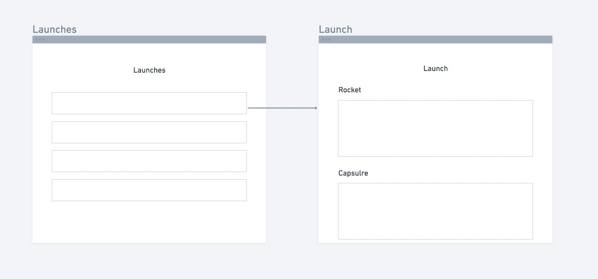

# Prospyr Pair Programming Exercise

This project was bootstrapped with [Create React App](https://github.com/facebook/create-react-app).

## Available Scripts

In the project directory, you can run:

### `yarn start`

Runs the app in the development mode.\
Open [http://localhost:3000](http://localhost:3000) to view it in the browser.

The page will reload if you make edits.\
You will also see any lint errors in the console.

## Our mission

Today we will be collaborating on a small React application that will query the SpaceX Graphql API and provide the user the ability to see a list of Launches and click into one to see it's details like the Rocket and Capsule.

## Specifications

We will build two screens, one with a list of _Launches_ and the other with a single _Launch_ details, specifically of the _Rocket_ and _Capsule_

The SpaceX GraphQL API is public, and can be played with [here](https://studio.apollographql.com/public/SpaceX-pxxbxen/home?variant=current)

We'll be using [Apollo](https://www.apollographql.com/) to communicate with the GraphQL API, here are some relevant links to Apollo docs:

- [useQuery hook](https://www.apollographql.com/docs/react/api/react/hooks/#usequery)
- [result data shape](https://www.apollographql.com/docs/react/api/react/hooks/#result)

The Apollo provider is already setup in `src/index.js` and connected to the SpaceX configured GQL client, so you can get started with pulling data into your components right away.

## Initial goal

- Build a screen that shows the last 10 launches from the SpaceX GraphQL API
- Build a screen that shows more details about a specific launch, that will be linked to from the launch list screen you created

## Let's explore further into space

- How would you improve the interface?
- Are there any features that you think would be exciting?
- Data visualization?
  - Launches per day
  - Visualize ship age vs successful landings
- Responsiveness
  - How would we add a mobile breakpoint?
- Working with time:
  - Find launches by day using datepicker
  - Show a launch calendar view
